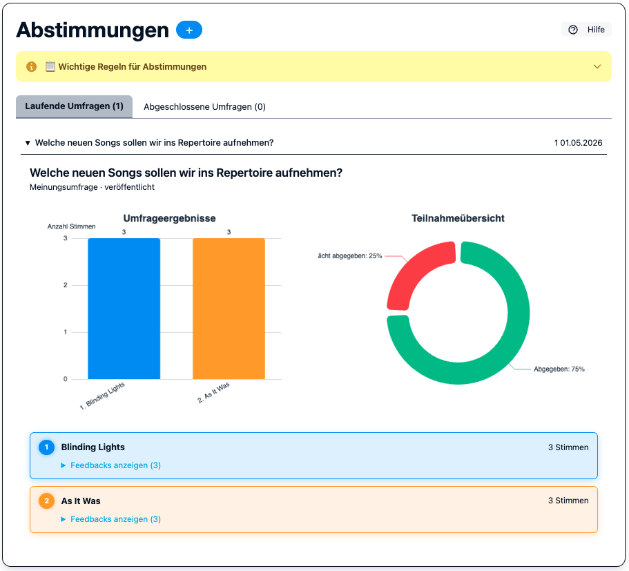

.. _abstimmungen:

Abstimmungen
============

Im Bereich **Abstimmungen** können drei Typen von Umfragen erstellt werden.

Abstimmung anlegen
------------------

Admins und Editors können über **+ Neue Abstimmung** eine neue Umfrage anlegen.
Im Formular wird zunächst der **Typ** der Abstimmung gewählt.

Umfragetypen
------------

Meinungsumfrage
~~~~~~~~~~~~~~~

Eine klassische Umfrage mit einer Frage und vordefinierten Antwortmöglichkeiten.
Ergebnisse sind in Echtzeit als Balkendiagramm sichtbar.

Terminfindung
~~~~~~~~~~~~~

Ermittelt einen gemeinsamen Termin für z. B. eine Sonderprobe.

* Der Ersteller gibt mehrere mögliche Termine vor.
* Jedes Mitglied markiert die Termine, an denen es kann (✓) oder nicht kann (✗).
* Das Ergebnis zeigt, welcher Termin die meisten Zusagen hat.

Auftrittsanfrage
~~~~~~~~~~~~~~~~

Wird eingesetzt, wenn eine Anfrage für einen Auftritt eingegangen ist.

* Der Ersteller beschreibt den geplanten Auftritt.
* Alle Mitglieder stimmen ab: **Ja / Nein / Vielleicht**.

Abstimmung schließen
--------------------

Nach dem Schließen können keine weiteren Stimmen abgegeben werden.
Die Ergebnisse bleiben dauerhaft einsehbar.

Benachrichtigungen
------------------

Wenn Mattermost konfiguriert ist (siehe :ref:`configuration`), erhalten Bandmitglieder
eine Benachrichtigung, sobald eine neue Abstimmung gestartet wird.
