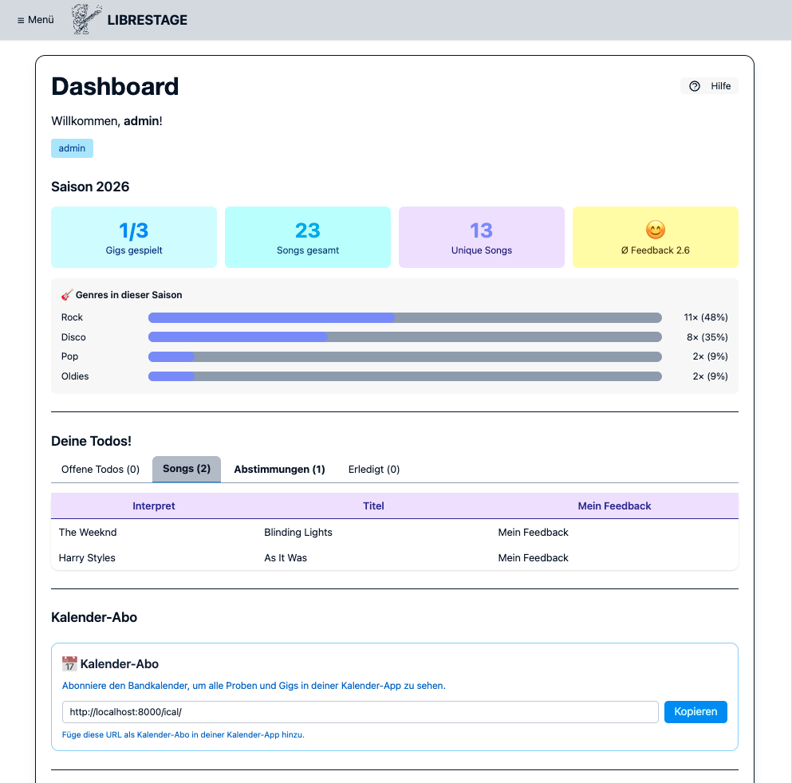

.. _dashboard:

Dashboard
=========

Das Dashboard ist die erste Seite nach dem Login. Es zeigt auf einen Blick alle
persönlichen Aufgaben, offene Abstimmungen und die Saison-Statistiken der Band.

Todos
-----

Der Bereich **Deine Todos** listet alle ausstehenden Aufgaben in sechs Tabs auf.
Der Tab mit den meisten offenen Punkten wird beim Öffnen automatisch ausgewählt.
Sind alle Bereiche leer, erscheint eine Erfolgsmeldung.

.. list-table::
   :header-rows: 1
   :widths: 20 80

   * - Tab
     - Inhalt
   * - **Offene Todos**
     - Persönliche Song-Aufgaben aus Proben, die noch nicht erledigt sind.
       Klick auf **✓** markiert ein Todo als erledigt und verschiebt es in den
       Tab „Erledigt".
   * - **Checkliste**
     - Offene Gig-Checklisten-Aufgaben, die dem eingeloggten Mitglied persönlich
       zugewiesen sind. Ein Klick auf eine Aufgabe öffnet das
       :ref:`Detailmodal <checkliste>` mit allen Informationen. Admins und Editors
       können Aufgaben direkt als erledigt markieren.
   * - **Songs**
     - Songs im Status *Vorschlag*, für die noch kein persönliches Feedback
       abgegeben wurde.
   * - **Abstimmungen**
     - Laufende Umfragen, an denen noch nicht teilgenommen wurde.
   * - **Gig-Rückmeldungen**
     - Bevorstehende Gigs, für die noch keine Verfügbarkeitsrückmeldung
       (✅ Dabei / ❓ Vielleicht / ❌ Nicht dabei) eingetragen wurde.
       Der Link **Rückmelden** führt zur Gig-Übersicht.
       Vollständige Dokumentation: :ref:`verfuegbarkeit`.
   * - **Erledigt**
     - Archiv aller abgeschlossenen Song-Todos zur Übersicht.

Nächste Termine
---------------

Die Kacheln **Nächste Probe** und **Nächster Auftritt** zeigen den jeweils
nächsten bevorstehenden Termin mit Datum und ggf. Kommentar.
Über die Schaltflächen **Zu Proben** und **Zu Gigs** gelangt man direkt zur
jeweiligen Listenansicht.

Saison-Statistiken
------------------

Das Widget **Saison** zeigt aggregierte Auswertungen des laufenden Jahres:

* Gespielte vs. geplante Gigs (Fortschrittsring)
* Gespielte Songs vs. einzigartige Songs (übersprungene Songs werden nicht gezählt)
* Feedback-Durchschnitt (Gauge)
* Top-5-Genres im Repertoire

Auf mobilen Geräten kann der Abschnitt mit **Mehr anzeigen / Weniger anzeigen**
ein- und ausgeklappt werden.

Kalender-Abo (iCal)
--------------------

Unter **Kalender-Abo** finden sich zwei abonnierbare Kalender-URLs:

* **Öffentlicher Kalender** – für alle zugänglich (Gigs und Proben ohne
  interne Infos)
* **Interner Kalender** – persönlicher Token, enthält zusätzliche interne
  Informationen; nicht öffentlich teilen

Die URLs können in Google Calendar, Apple Kalender, Thunderbird u. ä.
eingebunden werden (``webcal://``-Protokoll).
