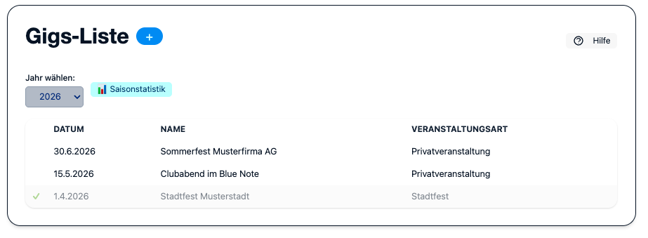
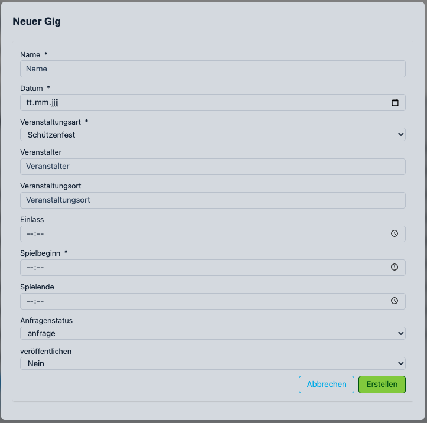
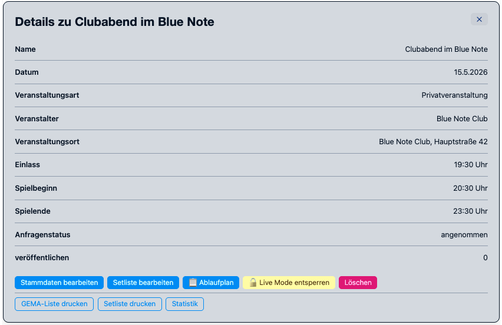
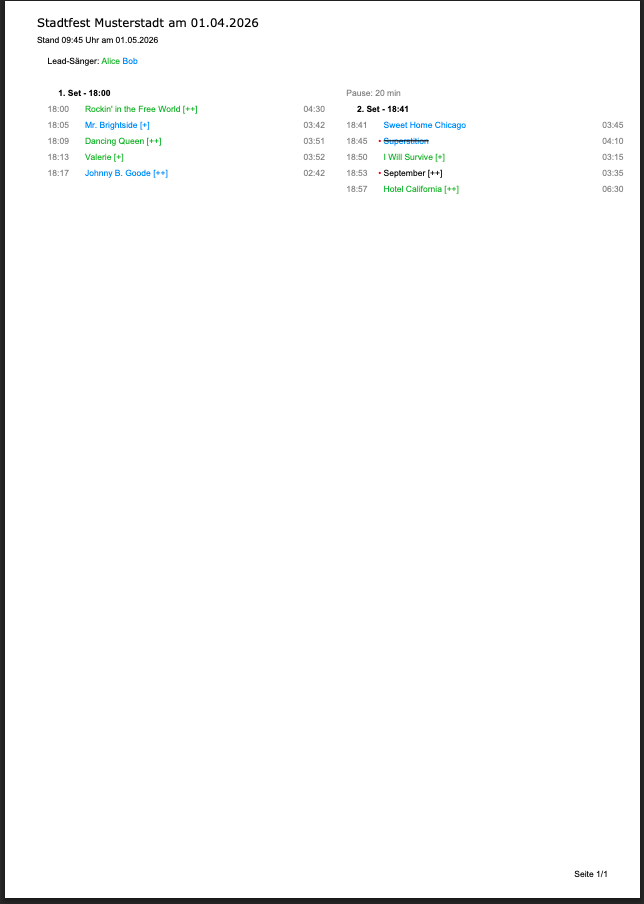
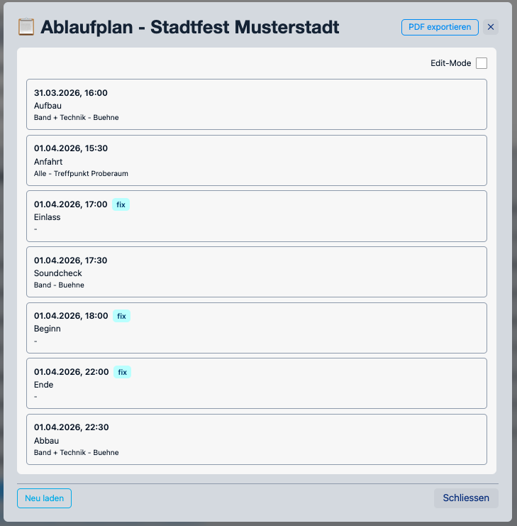
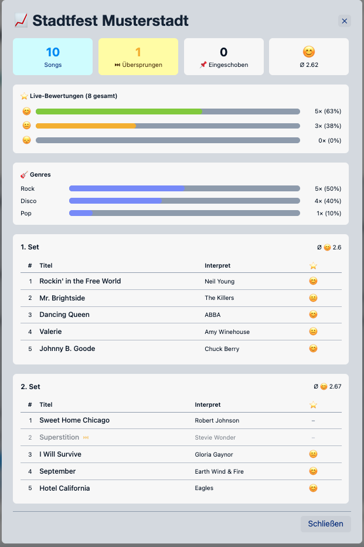
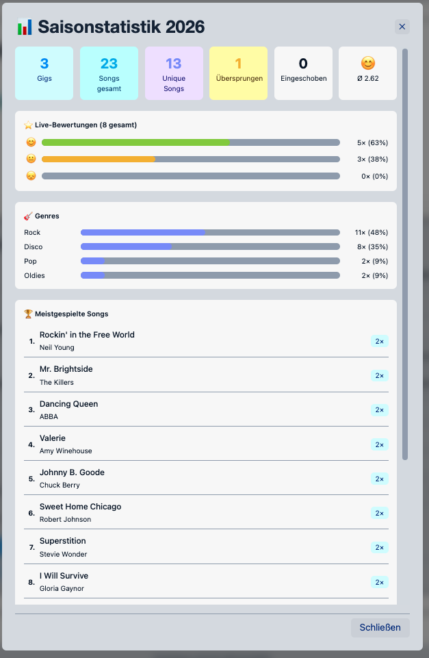

.. _gigs:

Gigs
====

Im Bereich **Gigs** werden alle Konzerte und Auftritte der Band verwaltet.
Admins und Editors können Gigs anlegen, bearbeiten und löschen.

Gig anlegen
-----------

Klicke auf **+ Neuer Gig**, um das Formular zu öffnen.

.. list-table::
   :header-rows: 1
   :widths: 25 75

   * - Feld
     - Beschreibung
   * - **Name**
     - Bezeichnung des Auftritts (z. B. „Stadtfest Hauptbühne“)
   * - **Datum**
     - Datum des Auftritts
   * - **Typ**
     - Veranstaltungstyp (aus ``appConfig.json`` konfigurierbar)
   * - **Veranstalter**
     - Name des Veranstalters
   * - **Location**
     - Ort / Adresse des Auftritts
   * - **Einlass**
     - Uhrzeit des Einlasses
   * - **Beginn**
     - Uhrzeit des Auftrittsbeginns
   * - **Ende**
     - Geplantes Ende des Auftritts
   * - **Kommentar**
     - Interne Anmerkungen (nicht öffentlich)

Status-Workflow
---------------

.. list-table::
   :header-rows: 1
   :widths: 20 80

   * - Status
     - Bedeutung
   * - **anfrage**
     - Auftrittsanfrage eingegangen, noch keine endgültige Zusage
   * - **angenommen**
     - Auftritt ist fest zugesagt und findet statt
   * - **abgelehnt**
     - Anfrage wurde abgelehnt

Setlist verwalten
-----------------

Jeder Gig hat eine eigene Setlist, die im :ref:`setlist_editor` bearbeitet wird.
Klicke auf **Setlist** in der Gig-Zeile, um den Editor zu öffnen.

Setlist-PDF generieren
-----------------------

Der Button **Setliste drucken** erzeugt ein druckfertiges PDF der Setlist mit allen Sets, Songs,
Tonarten, Dauern, Sängern sowie Gesamtspieldauer und Pausenzeiten.

Ablaufplan-PDF generieren
-------------------------

Der Button **Ablaufplan** erzeugt ein zeigt den zeitlichen Ablauf eines Gigs.

Enthalten sind:

* Gig-Stammdaten (Name, Datum, Typ, Veranstalter, Ort, Einlass/Beginn/Ende)
* Alle Ablauf-Einträge in einer tabellarischen Ansicht (Zeit, Was, Wer, Wo)
* Automatische Zeilenumbrüche bei langen Texten
* Hochformat (A4) mit optimierten Spaltenbreiten

Das Layout ist modernisiert und enthält ein dezentes Logo-Wasserzeichen.
Die Farbgestaltung passt sich automatisch an das hinterlegte Logo an
(``LogoCustom.png`` bzw. ``Logo.png``).

GEMA-Export (Excel)
--------------------

Der Button **GEMA** erzeugt ein Excel-Dokument im offiziellen GEMA-Meldeformat.
Songs, die im Live-Modus als *übersprungen* markiert wurden, werden automatisch ausgeschlossen.

Das Dokument enthält je Song: Titel, Interpret, Komponist, Texter, Bearbeiter, Verlag, Dauer.

Statistiken
-----------

Der Button **Statistiken** öffnet ein Modal mit der Auswertung des Gigs:
gespielte / übersprungene Songs, Bewertungsverteilung, Spielzeit vs. Plan.

Der Button **Saison-Statistiken** zeigt aggregierte Daten aller Gigs der laufenden Saison.

Verfügbarkeit
-------------

Im Tab **Übersicht** des Gig-Detail-Dialogs zeigt eine kompakte Karte die aktuellen
Verfügbarkeitsrückmeldungen der Bandmitglieder (Zähler ✅/❓/❌, farbige Name-Badges,
eingetragene Aushilfen). Der Link **Details →** öffnet direkt den Tab **Verfügbarkeit**,
in dem jedes Mitglied seinen Status setzen und eine Aushilfe benennen kann.

Vollständige Dokumentation: :ref:`verfuegbarkeit`.

