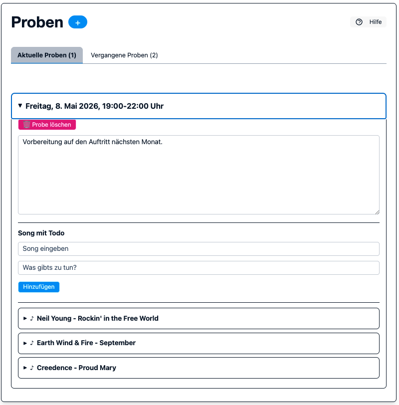
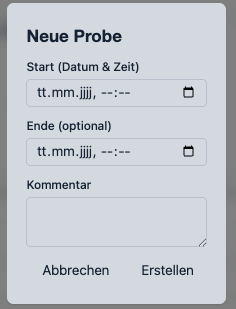
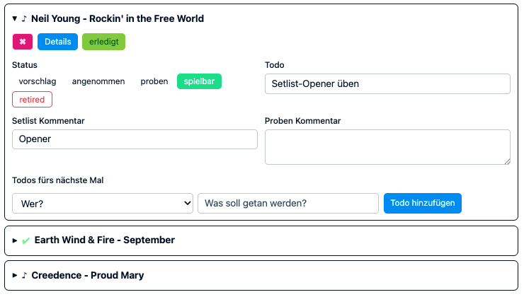
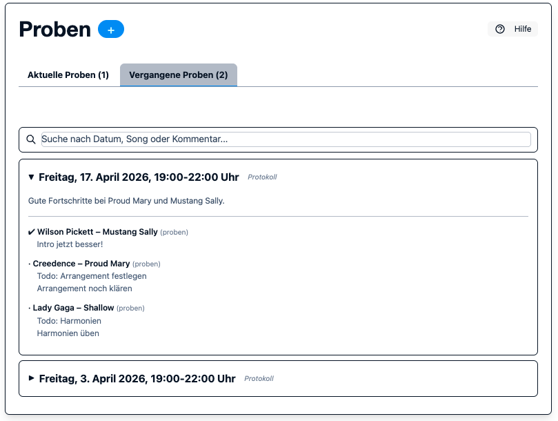

.. _proben:

Proben
======

Im Bereich **Proben** werden Bandproben geplant, vorbereitet und im Nachgang
als Protokoll dokumentiert.

Probe anlegen
-------------

Klicke auf das **+** neben der Ueberschrift **Proben**, um das Formular zu oeffnen.

.. list-table::
   :header-rows: 1
   :widths: 30 70

   * - Feld
     - Beschreibung
   * - **Start (Datum & Zeit)**
     - Pflichtfeld fuer den Beginn der Probe
   * - **Ende (optional)**
     - Optionales Enddatum mit Uhrzeit; muss nach dem Start liegen
   * - **Kommentar**
     - Freitext fuer interne Notizen

**Wichtig:** Wird keine Endzeit eingetragen, setzt das System automatisch
**Startzeit + 2 Stunden**.

Zeitraum in der Listenansicht
-----------------------------

Jede Probe wird als Zeitbereich angezeigt (z. B. ``18:00-20:30 Uhr``).

Stammdaten einer Probe bearbeiten
---------------------------------

Editoren und Admins können in einer geöffneten Probe im Bereich
**Stammdaten** die Felder **Beginn** und **Ende** nachträglich anpassen.

* **Beginn** ist ein Pflichtfeld.
* **Ende** ist optional, muss aber (falls gesetzt) nach dem Beginn liegen.
* Änderungen werden beim Verlassen des Felds gespeichert.

Songs und Todos in Proben
-------------------------

In einer aufgeklappten Probe können Songs hinzugefügt und pro Song Todos,
Status und Kommentare gepflegt werden.

* Song zur Probe hinzufügen (inkl. Todo)
* Song-Status direkt in der Probe ändern
* Persönliche Todos pro Mitglied vergeben
* Song und Probenkommentare dokumentieren

Protokoll führen
----------------

Während der Probe können Kommentare und Todos jederzeit aktualisiert werden. Nach Ende der Probe wird die gesamte Probe als schreibgeschütztes Protokoll
angezeigt, um die Dokumentation der Probe zu sichern.

Geht während der Probe nach und nach durch die Songs und aktualisiert den Status (z. B. „gespielt“, „übersprungen“, „nicht gespielt“), fügt Kommentare hinzu und vergebt persönliche Todos (z. B. „Solo üben“). So entsteht automatisch ein vollständiges Protokoll der Probe.

Vergesst nicht, nach der Probe eines Songs auch den Song-Status anzupassen und den Song als "erledigt" zu markieren. So wird er in der Listenübersicht als abehakt markiert und ihr behaltet den Überblick über den Fortschritt der Probe.

Vergangene Proben - Protokoll-Ansicht
-------------------------------------

Vergangene Proben werden im Tab **Vergangene Proben** als schreibgeschütztes
Protokoll angezeigt.

Das Protokoll zeigt:

* den Probenkommentar als Freitext
* alle Songs inkl. Status, Todo und Kommentaren
* persönliche Todos mit Statussymbolen (``✔`` erledigt, ``⏳`` offen)

Suche in vergangenen Proben
---------------------------

Das Suchfeld oberhalb der Liste durchsucht die komplette Historie vergangener
Proben serverseitig (nicht nur die aktuell sichtbaren Einträge) nach:

* Datum
* Song-Titel
* Interpret
* Probenkommentar

Treffer werden in der aufgeklappten Protokollansicht farblich hervorgehoben.
Falls viele Treffer vorhanden sind, kann die Liste über **Mehr laden**
seitenweise erweitert werden.

iCal-Export
-----------

Proben erscheinen automatisch im öffentlichen iCal-Feed unter ``/ical/``.
Der Kalendereintrag enthält den Zeitbereich (Start-Ende) im Titel und in der
Beschreibung.

Verfügbarkeit
-------------

Im Probe-Detail-Dialog (aufgeklappte Probe) befindet sich oben ein
aufklappbarer Bereich **📅 Verfügbarkeit**.
Jedes Mitglied kann dort seinen Status (✅ Dabei, ❓ Vielleicht, ❌ Nicht dabei)
eintragen sowie bei Abwesenheit eine Aushilfe benennen.

Vollständige Dokumentation: :ref:`verfuegbarkeit`.
