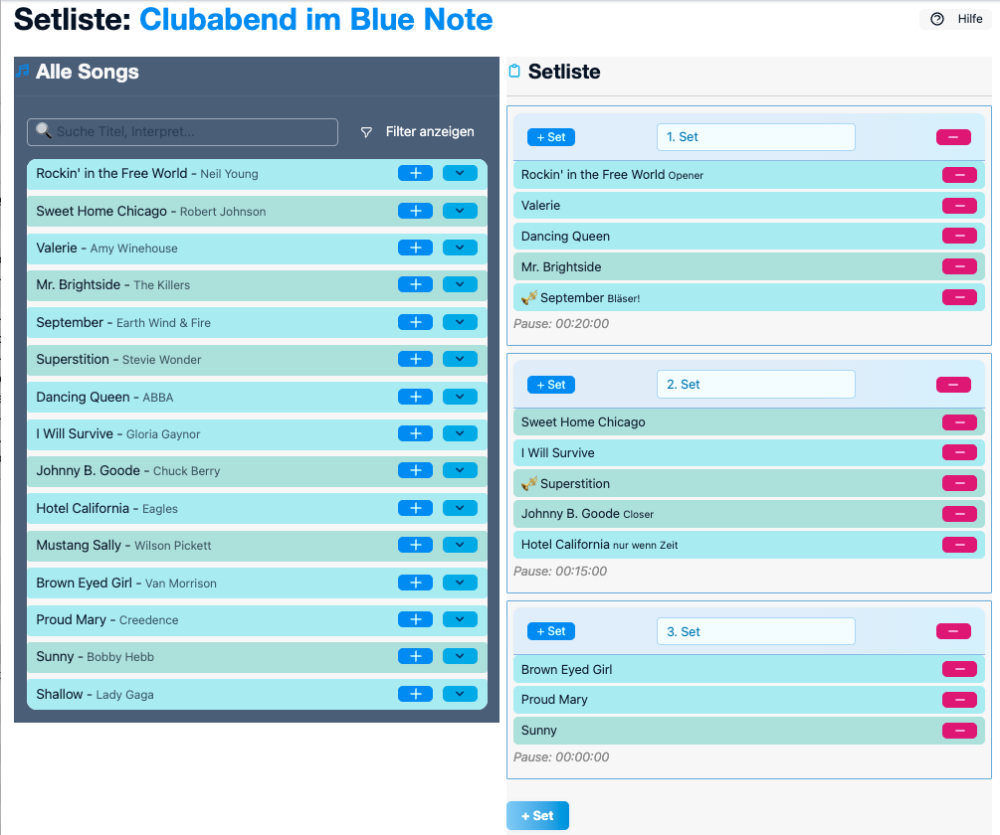

.. _setlist_editor:

Setlist-Editor
==============

Der Setlist-Editor ermöglicht es, Setlists für Gigs zu erstellen und zu bearbeiten.
Er unterstützt mehrere Sets, Drag & Drop sowie automatische Zeitberechnung.

Sets anlegen
------------

Über den Button **+ Set** wird ein neues Set an die Setlist angehängt.
Jedes Set bekommt automatisch einen Namen (z. B. „Set 1“, „Set 2“, …).

Set umbenennen
~~~~~~~~~~~~~~

Klicke auf den Set-Namen, um ihn inline zu bearbeiten.
Drücke **Enter** oder klicke außerhalb des Feldes, um den Namen zu speichern.

Set löschen
~~~~~~~~~~~

Über den Button **-** am Set-Header kann das gesamte Set gelöscht werden.

Songs hinzufügen
----------------

Im unteren Bereich des Editors befindet sich eine Songliste mit allen Songs,
deren Status ``spielbar`` ist.

* Klicke auf einen Song, um ihn dem aktuell ausgewählten Set hinzuzufügen.
* Im Suchfeld kann nach Titel oder Interpret gesucht werden.
* Mit **Enter** wird der erste Suchtreffer direkt am Ende der Setlist hinzugefügt.

Drag & Drop
-----------

* **Innerhalb eines Sets:** Ziehe einen Song an die gewünschte Position.
* **Zwischen Sets:** Ziehe einen Song auf ein anderes Set.

Zeitberechnung
--------------

libreStage berechnet die Spielzeit automatisch aus den hinterlegten Song-Dauern.
Die Gesamtdauer und geplante Endzeit werden in Echtzeit aktualisiert.

Pausen
~~~~~~

Zwischen Sets wird automatisch eine Pause eingeplant. Die Standard-Pausenlänge wird
in ``appConfig.json`` über das Feld ``default_break_seconds`` konfiguriert.
Die Pausenlänge kann für jeden Übergang im Editor angepasst werden.

Sänger-Farb-Kodierung
----------------------

Jeder Sänger erhält automatisch eine eigene Farbe als farbiger Balken
links neben dem Song-Titel.

Tastaturkürzel
--------------

.. list-table::
   :header-rows: 1
   :widths: 20 80

   * - Taste
     - Funktion
   * - **Enter**
     - Ersten Suchtreffer zum aktuellen Set hinzufügen
   * - **Esc**
     - Suchfeld leeren / Fokus aufheben
