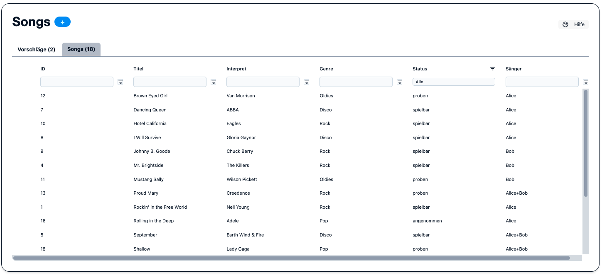
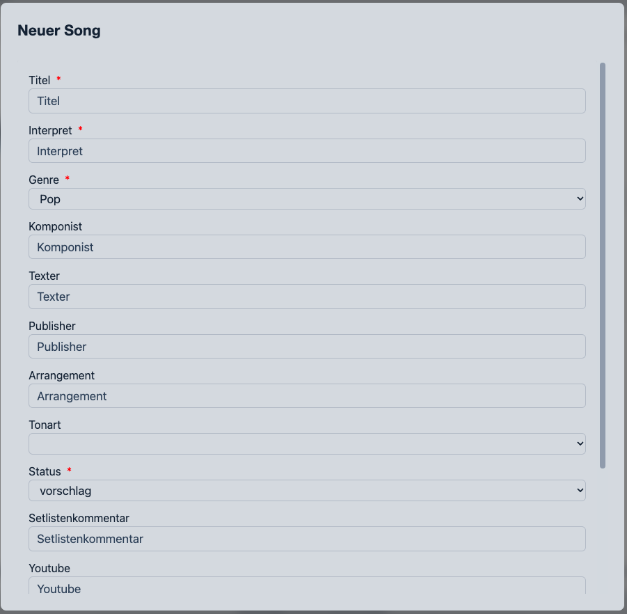
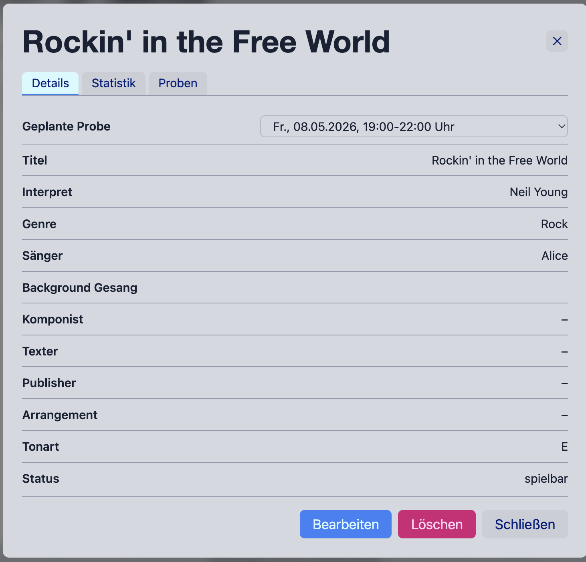
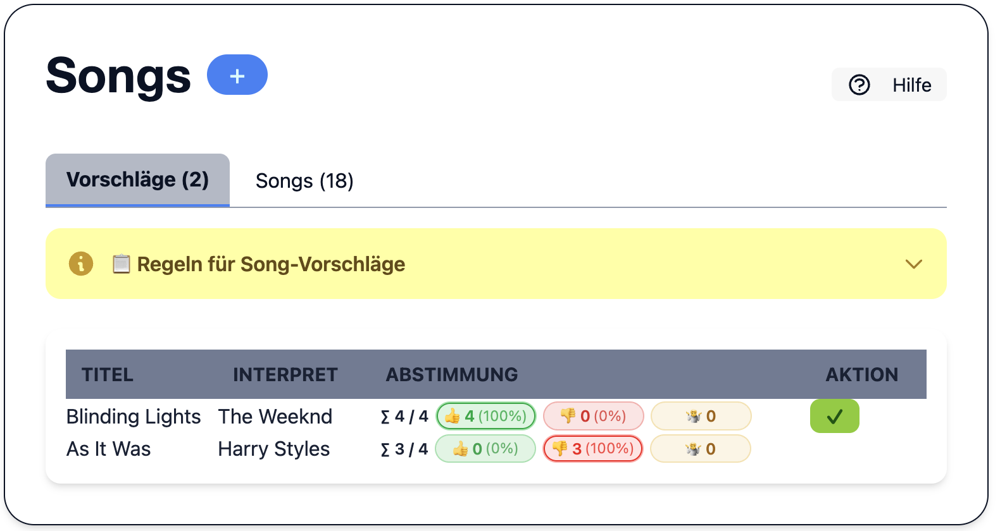

.. _songs:

Song-Datenbank
==============

Die Song-Datenbank enthält das gesamte Repertoire der Band.
Admins und Editors können Songs anlegen, bearbeiten und archivieren.

Song anlegen
------------

Klicke auf **+ Neuer Song**, um das Formular zu öffnen.

.. list-table::
   :header-rows: 1
   :widths: 25 75

   * - Feld
     - Beschreibung
   * - **Titel**
     - Offizieller Songtitel
   * - **Interpret**
     - Ursprünglicher Interpret
   * - **Komponist**
     - Name(n) der Komponisten (für GEMA-Export)
   * - **Texter**
     - Name(n) der Texter (für GEMA-Export)
   * - **Bearbeiter**
     - Name des Bearbeiters (falls eigenes Arrangement)
   * - **Verlag**
     - Musikverlag (für GEMA-Export)
   * - **Tonart**
     - Tonart des Songs (z. B. „Am“, „G“, „C#“)
   * - **Dauer**
     - Spielzeit in Minuten:Sekunden (z. B. ``3:45``)
   * - **Genre**
     - Genre aus der konfigurierten Liste (siehe :ref:`configuration`)
   * - **Status**
     - Aktueller Status im Workflow (s. u.)
   * - **Sänger**
     - Hauptsänger aus der Sängerliste

.. tip::
   Beim Ausfuellen von **Titel** und **Interpret** erfolgt direkt im Formular
   eine Live-Pruefung auf wahrscheinliche Dubletten (inklusive kleiner
   Schreibfehler oder Abweichungen). Wenn ein aehnlicher Song bereits existiert,
   erscheint unter dem Feld **Interpret** ein Warning-Hinweis mit dessen Status.
   Das Speichern bleibt trotzdem moeglich.

Status-Workflow
---------------

.. list-table::
   :header-rows: 1
   :widths: 25 75

   * - Status
     - Bedeutung
   * - **vorschlag**
     - Song wurde vorgeschlagen, aber noch nicht bewertet
   * - **angenommen**
     - Song ist grundsätzlich akzeptiert
   * - **proben**
     - Song wird aktiv geprobt
   * - **spielbar**
     - Song ist bühnenreif – erscheint im Setlist-Editor
   * - **bedarfsweise_proben**
     - Song ist spielbar, wird aber bei Bedarf nochmals geprobt

.. note::
   Nur Songs mit Status **spielbar** oder **bedarfsweise_proben** erscheinen
   im Setlist-Editor.

Filtern und Suchen
------------------

* Status (Mehrfachauswahl)
* Genre
* Sänger
* Freitextsuche (Titel / Interpret)

Song-Details und Statistiken
-----------------------------

Ein Klick auf einen Song öffnet die Detailansicht mit:

* Alle Felder des Songs
* **Proben-Historie:** Wie oft und wann wurde der Song geprobt?
* **Gig-Historie:** Bei welchen Auftritten wurde der Song gespielt, mit Bewertungen?
* **Feedback-Verteilung:** Balkendiagramm der Bewertungen aus dem Live-Modus
* **Häufige Begleiter:** Welche anderen Songs erscheinen am häufigsten in derselben Setlist?

Song-Vorschläge & Abstimmung
-----------------------------

Neu eingereichte Songs erhalten zunächst den Status **vorschlag** und erscheinen
im Tab **Vorschläge** der Song-Seite. Dort können alle stimmberechtigten
Bandmitglieder (Musiker) ihr Votum abgeben, bevor ein Song offiziell übernommen wird.

Abstimmen
~~~~~~~~~

Jedes Mitglied mit dem Flag **Musiker** kann pro Song eine von drei Stimmen abgeben:

.. list-table::
   :widths: 15 85

   * - 👍
     - **Ja** – ich möchte den Song ins Repertoire aufnehmen
   * - 👎
     - **Nein** – ich bin gegen die Aufnahme
   * - 🤷
     - **Enthaltung** – ich habe keine Meinung / möchte mich enthalten

Dieselbe Schaltfläche nochmals klicken zieht die Stimme zurück.

Abstimmungsergebnis auf einen Blick
~~~~~~~~~~~~~~~~~~~~~~~~~~~~~~~~~~~~

Das Ergebnis wird je Song als kompakte Badge-Zeile angezeigt:

* **∑ x / y** – abgegebene Stimmen (Ja + Nein + Enthaltung) von y Stimmberechtigten gesamt
* **(n f. Quorum)** – Hinweis, wie viele Stimmen noch für das Quorum fehlen
* 👍 **n (xx %)** – absolute und relative Anzahl der Ja-Stimmen
* 👎 **n (xx %)** – absolute und relative Anzahl der Nein-Stimmen
* 🤷 **n** – Enthaltungen (werden nur angezeigt, wenn mindestens eine vorliegt)

Freigabe-Kriterien
~~~~~~~~~~~~~~~~~~

Der **✓-Button** erscheint für Admins und Editoren, sobald gleichzeitig gilt:

1. Mindestens **75 % aller Stimmberechtigten** haben abgestimmt (Quorum –
   Enthaltungen zählen mit).
2. Der Ja-Anteil unter den gültigen Stimmen (Ja + Nein) beträgt **≥ 50 %**.

.. note::
   Das Quorum wird berechnet als ``max(3, floor(Anzahl Musiker × 0,75))``.
   Bei 4 Musikern sind das mindestens 3 Stimmen, bei 8 Musikern mindestens 6.

Song übernehmen
~~~~~~~~~~~~~~~

Sind alle Kriterien erfüllt, erscheint für **Admins und Editoren** ein grüner
**✓-Button** in der Aktionsspalte. Ein Klick übernimmt den Song offiziell
und setzt seinen Status auf **angenommen**.

Solange das Quorum nicht erreicht ist, wird kein Button angezeigt.

Persönliche Abstimmung
~~~~~~~~~~~~~~~~~~~~~~

Wurde in einer Probe direkt per Handzeichen abgestimmt, kann ein Admin/Editor
den Song ohne digitale Abstimmung direkt als **angenommen** eintragen –
vorausgesetzt, die anwesenden Stimmberechtigten haben mehrheitlich zugestimmt
(Enthaltungen zählen nicht).
